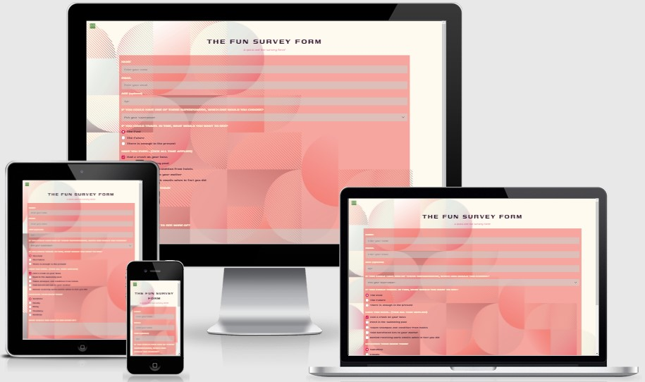

# Survey Form Page

This is a freeCodeCamp Responsive Web Design Project.

The overall aim was to acheive a Survey Form page, this was only focusing on using HTML, CSS and SASS to help me develop my front end skills further!

## Showcase

 

A deployed version of my website can be found [here](https://elliej87.github.io/SurveyForm/)

This domain will allow you to access the Tribute Page website.

## Table of Contents

1. [User Experience UX](#userexperienceuX)

    * [User Stories](#userstories)

        - [User Story #1](#userstory_1)
        - [User Story #2](#userstory_2)
        - [User Story #3](#userstory_3)
        - [User Story #4](#userstory_4)
        - [User Story #5](#userstory_5)
        - [User Story #6](#userstory_6)
        - [User Story #7](#userstory_7)
        - [User Story #8](#userstory_8)
        - [User Story #9](#userstory_9)
        - [User Story #10](#userstory_10)
        - [User Story #11](#userstory_11)
        - [User Story #12](#userstory_12)
        - [User Story #13](#userstory_13)
        - [User Story #14](#userstory_14)
        - [User Story #15](#userstory_15)
        - [User Story #16](#userstory_16)
        - [Site Owner Goals](#sitegoals)

2. [Wireframes](#wireframesboards)

3. [Features](#featuressite)

    * [Main Container](#maincontainer)
    * [Footer](#footerfeatures)

4. [Technologies Used](#technologies)

    * [Version Control](#versioncontrol)

5. [Functionality Testing](#functionalitytesting)
  
    - [Footer Social Navigation Links](#footerlinks)
      * [LinkedIn Icon](#linkedinicon)
      * [GitHub Icon](#githubicon)

6. [Responsive Design Testing](#responsivedesigntesting)

7. [Validation](#validationcode)
    - [HTML](#htmlcode)
    - [CSS](#csscode) 

8. [Deployment](#deploymentsite)

    * [Repository Link](#repositorylink)
    * [Running Code Locally](#runningcodelocally)

9. [Credits](#finalcredits)

    * [Content](#contentsite)
    * [Acknowledgments](#acknowledgmentsthanks)

## <a name="userexperienceuX">UX (User Experience)</a>

This website is to practice my SCSS, HTML and CSS skills, for future development I plan to add JavaScript to help capture and validate this form.

This site has links to my social media sites where they can interact with me directly.

## <a name="userstories">User Stories</a>

### <a name="userstory_1">User Story #1</a>

- I can see a title with id="title" in H1 sized text.

### <a name="userstory_2">User Story #2</a>

- I can see a short explanation with id="description" in P sized text.

### <a name="userstory_3">User Story #3</a>

- I can see a form with id="survey-form".

### <a name="userstory_4">User Story #4</a>

- Inside the form element, I am required to enter my name in a field with id="name".

### <a name="userstory_5">User Story #5</a>

- Inside the form element, I am required to enter an email in a field with id="email".

### <a name="userstory_6">User Story #6</a>

- If I enter an email that is not formatted correctly, I will see an HTML5 validation error.

### <a name="userstory_7">User Story #7</a>

- Inside the form, I can enter a number in a field with id="number".

### <a name="userstory_8">User Story #8</a>

- If I enter non-numbers in the number input, I will see an HTML5 validation error.

### <a name="userstory_9">User Story #9</a>

- If I enter numbers outside the range of the number input, which are defined by the min and max attributes, I will see an HTML5 validation error.

### <a name="userstory_10">User Story #10</a>

- For the name, email, and number input fields inside the form I can see corresponding labels that describe the purpose of each field with the following ids: id="name-label", id="email-label", and id="number-label".

### <a name="userstory_11">User Story #11</a>

- For the name, email, and number input fields, I can see placeholder text that gives me a description or instructions for each field.

### <a name="userstory_12">User Story #12</a>

- Inside the form element, I can select an option from a dropdown that has a corresponding id="dropdown".

### <a name="userstory_13">User Story #13</a>

- Inside the form element, I can select a field from one or more groups of radio buttons. Each group should be grouped using the name attribute.

### <a name="userstory_14">User Story #14</a>

- Inside the form element, I can select several fields from a series of checkboxes, each of which must have a value attribute.

### <a name="userstory_15">User Story #15</a>

- Inside the form element, I am presented with a textarea at the end for additional comments.

### <a name="userstory_16">User Story #16</a>

- Inside the form element, I am presented with a button with id="submit" to submit all my inputs.

### <a name="sitegoals">Site Owner Goals</a>

- As a site owner I wanted to create and build a template form using HTML validation and styling with scss.

## <a name="wireframesboards">Wireframes</a>

As this was a brief project no wireframes were designed prior to building this site.

## <a name="featuressite">Features</a>

This section is a brief highlight of features that this site contains.

### <a name="maincontainer">Main Container</a>

- The main body is vertically centered in the view port width
- Header title is center to the view port width
- Form has contrast back ground colour with light opacity so text is visible
- Input fields are contrast colour with placeholder text in a clear and visible colour
- Radio & Checkboxes are colour themed to match the main theme
- Button on hover has a effect so the user is aware they are hoving over the button

### <a name="footerfeatures">Footer</a>

- Contains the copyright text, this is on the right side of the page which is then centred and on the bottom of the social media links on smaller screens for easy readability.
- Contains the ‘LinkedIn’ and ‘GitHub’ navigation links on the left side of the page and evenly spaced these are then stacked ontop of the copyright text, these are centred to the width of the screen
- All navigation links have an animation and a colour change when the user hover over the icon, this is so the user knows they are interactive and have a purpose
- The ‘LinkedIn’ and ‘GitHub’ icons opens a new window to the relevant page 
- The footer runs along and is fixed at the bottom with no fill colour to make this easy to read and visual appealing

## <a name="technologies">Technologies Used</a>

[Bootstrap](https://getbootstrap.com)

- The project uses the Bootstrap framework to add a responsive grid system, prebuilt components, plugins built on jQuery, and Bootstrap styles to my site, before adding my own custom styling 

[CSS](https://en.wikipedia.org/wiki/CSS)

- The project uses CSS to apply the custom styles to create the look of my site.  The index.html file is linked directly to the main.css stylesheet

[Font Awesome](https://fontawesome.com/v4.7/) 

- The project uses Font Awesome icons for all navigation and social media links that feature in the header and footer of my site

Google Chrome Dev Tools

- For testing purposes for responsive design

[HTML5](https://en.wikipedia.org/wiki/HTML5)

- The project uses HTML to create the basic elements and content of my site 

[JavaScript](https://en.wikipedia.org/wiki/JavaScript)

- The project also uses JavaScript from Bootstrap which is required to add functionality to the Bootstrap modal 

[jQuery](https://en.wikipedia.org/wiki/JQuery)

- The project uses jQuery to simplify DOM manipulation. This is both the standard jQuery that is built with Bootstrap components

[SASS](https://en.wikipedia.org/wiki/Sass_(stylesheet_language))

- The project uses SASS to apply the custom styles to create the look of my site.  The index.html file is linked directly to the main.css stylesheet

[Visual Studio Code](https://code.visualstudio.com)

- I used Visual Studio Code as the development environment to write the code for my website

### <a name="versioncontrol">Version Control</a>

[Git](https://git-scm.com)

-	I've used Git as a version control system to regularly add and commit changes made to project in Visual Studio Code, before pushing them to GitHub.

[GitHub](https://github.com)

-	I've used GitHub as a remote repository to push and store the committed changes to my project from Git. I've also used GitHub pages to deploy my website in a live environment.

## <a name="testingcases">Testing</a>

# <a name="functionalitytesting">Functionality Testing</a>

Browsers tested: Google Chrome, Mozilla Firefox & Opera.
The devices used in this testing include Samsung S10 v.Android 10.

## <a name="footerlinks">Footer Social Navigation Links</a>

### <a name="linkedinicon">LinkedIn Icon</a>

Expected: when hovering over 'LinkedIn' icon, the icon changes colour and has a hover animation effect
Testing: tested by hovering over item
Result: icon changes colour

Expected: when clicking on the ‘LinkedIn’ icon takes the user to my LinkedIn page
Testing: tested by clicking on the ‘LinkedIn’ icon
Results: link takes user to [LinkedIn](https://www.linkedin.com/in/ellie-judge-45b00689/)
 
### <a name="githubicon">GitHub Icon</a>

Expected: when hovering over 'GitHub' icon, the icon changes colour and has a hover animation effect
Testing: tested by hovering over item
Result: icon changes colour

Expected: when clicking on the ‘GitHub’ icon takes the user to my GitHub repo page
Testing: tested by clicking on the ‘GitHub’ icon
Results: link takes user to [GitHub](https://github.com/EllieJ87)

## <a name="validationcode">Validation</a>

### <a name="htmlcode">HTML</a>

W3C testing completed for: index.html
No issues were stated.
 
## <a name="csscode">CSS</a>

W3C testing completed for: styles.css
No issues were stated.

## <a name="deploymentsite">Deployment</a>

The hosting platform that I've used for my project is GitHub Pages. To deploy my website to GitHub pages, I used the following steps:

-	Loaded the terminal window in my visual studio code workspace
-	Initialised Git using the Source Control in the control panel
-	Files that have been amended are automatically listed in the ‘Source Control’ panel
-	Add message in the ‘Message’ section, making sure the commits are clear and concise (re-checked previous commits for layout and what was fixed / still pending)
-	Click the ‘tick’ icon which stored the files in visual studio code
-	Click the ‘ellipsis’ icon and select the ‘push’ option
-	This then push all files and commits to the main branch
-	This will add the updated files into the ‘main branch’ option under the ‘GitHub pages’ section
-	Ran several commits after testing was carried out throughout my project.

### <a name="repositorylink">Repository Link</a>

[Survey Form](https://elliej87.github.io/SurveyForm/)

### <a name="runningcodelocally">Running Code Locally</a>

To run my code locally, users can download a local copy of my code to their desktop by completing the following steps:

-	Go to my GitHub repository.
-	Click on 'Clone or download'.
-	Click on 'Download ZIP'.
-	Once downloaded, extract the zip file's contents and run my website locally.

## <a name="contentsite">Content</a>

This website was a quick and fun site for me to practice more web development skills and styling .

Background image was styled and designed by me.

## <a name="acknowledgmentsthanks">Acknowledgments</a>

_**Created by Ellie Judge**_
